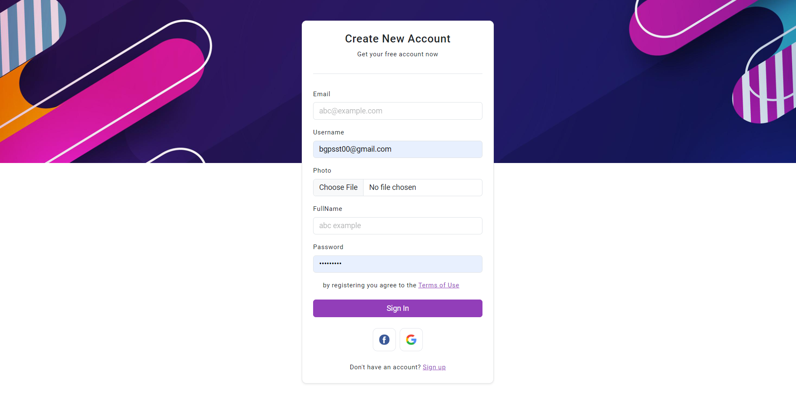

# happycode
- database (mariadb)
import database db_happycode yang ada didalam folder database, ke database anda

- backend (nodejs expressjs)

npm i

untuk run mode dev:

npm run dev

untuk run mode prodaction

npm run tsc

npm run start

- frontend (codeigniter 3 menggunakan php 7.4)

untuk menjanlakan fronted buka folder frontend via cmd / terminal run:

php -S localhost:80

view login

view registrasi

view table

documentasi API

url api :  http://localhost:3000

https://documenter.getpostman.com/view/18452404/2s9YBxYb67